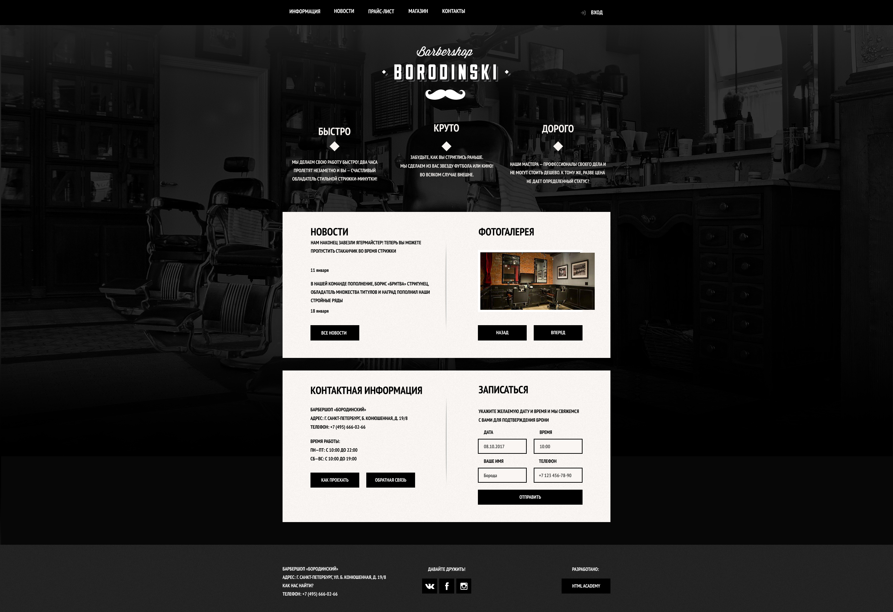

<h4 align="center">barbershop</h4>

Сайт barbershop

<h4 align="center">Прект для практики верстки</h4>

<h4 align="center">Содержание</h4>
<ol>

    <li>Гланая</li>
    <li>Прайс лист</li>
    <li>Магазин </li>
    <li>Карточка перевого товра </li>
    <li>Модальное окно на JS. для входа и регистрации</li>

 </ol>

<!-- <h4 align="center">В играх применяется:</h4>

* [Python 3.9](https://www.python.org/downloads/release/python-369/)
* [Django 3](https://www.djangoproject.com/) как основной фреймворк для бекенда

<h3 align="center">Программа Курса</h4>

<h6>
Прект № 1
</h6>
   <li>Форма обратной связи JS + Django</li>
   <h5>
Описание
</h5> -->
